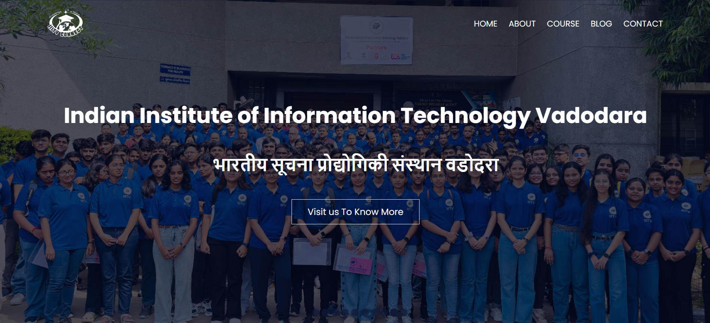

# 🎓 IIITV Connect

Welcome to the **IIITV Connect** repository! This project is a fully responsive and modern website designed for the Indian Institute of Information Technology, Vadodara (IIITV). Built with React.js, the website features various sections, including About Us, Courses, Events, and Contact Us, each carefully crafted to offer an informative and user-friendly experience for students, faculty, and visitors alike.

### 🌐 Live Preview

Check out the live version of the website [here](https://iiitv-connect.vercel.app/)

### 🌐 Screenshots

Here's a sneak peek of what the website looks like:

### 🛠️ Tech Stack Used

- **Frontend:** React.js
- **Styling:** CSS
- **Routing:** React Router DOM

